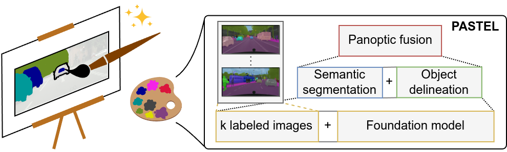

# PASTEL
[**arXiv**](https://arxiv.org/abs/2405.19035) | [**Website**](http://pastel.cs.uni-freiburg.de/) | [**Video**](https://youtu.be/fC4vapiJTb8)

This repository is the official implementation of the paper:

> **A Good Foundation is Worth Many Labels: Label-Efficient Panoptic Segmentation**
>
> [Niclas Vödisch](https://vniclas.github.io/)&ast;, [Kürsat Petek](http://www2.informatik.uni-freiburg.de/~petek/)&ast;, [Markus Käppeler](https://rl.uni-freiburg.de/people/kaeppelm)&ast;, [Abhinav Valada](https://rl.uni-freiburg.de/people/valada), and [Wolfram Burgard](https://www.utn.de/person/wolfram-burgard/). <br>
> &ast;Equal contribution. <br> 
> 
> *arXiv preprint arXiv:2405.19035*, 2024

<p align="center">
  
</p>

If you find our work useful, please consider citing our paper:
```
@article{voedisch2024pastel,
  title={A Good Foundation is Worth Many Labels: Label-Efficient Panoptic Segmentation},
  author={Vödisch, Niclas and Petek, Kürsat and Käppeler, Markus and Valada, Abhinav and Burgard, Wolfram},
  journal={arXiv preprint arXiv:2405.19035},
  year={2024}
}
```


## 📔 Abstract

A key challenge for the widespread application of learning-based models for robotic perception is to significantly reduce the required amount of annotated training data while achieving accurate predictions. This is essential not only to decrease operating costs but also to speed up deployment time. In this work, we address this challenge for PAnoptic SegmenTation with fEw Labels (PASTEL) by exploiting the groundwork paved by visual foundation models. We leverage descriptive image features from such a model to train two lightweight network heads for semantic segmentation and object boundary detection, using very few annotated training samples. We then merge their predictions via a novel fusion module that yields panoptic maps based on normalized cut. To further enhance the performance, we utilize self-training on unlabeled images selected by a feature-driven similarity scheme. We underline the relevance of our approach by employing PASTEL to important robot perception use cases from autonomous driving and agricultural robotics. In extensive experiments, we demonstrate that PASTEL significantly outperforms previous methods for label-efficient segmentation even when using fewer annotation.


## 👩‍💻 Code

We will release the code upon the acceptance of our paper.


## 👩‍⚖️  License

For academic usage, the code is released under the [GPLv3](https://www.gnu.org/licenses/gpl-3.0.en.html) license.
For any commercial purpose, please contact the authors.


## 🙏 Acknowledgment

This work was funded by the German Research Foundation (DFG) Emmy Noether Program grant No 468878300.
<br><br>
<p float="left">
  <a href="https://www.dfg.de/en/research_funding/programmes/individual/emmy_noether/index.html"></a>
</p>
